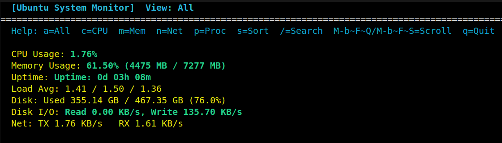
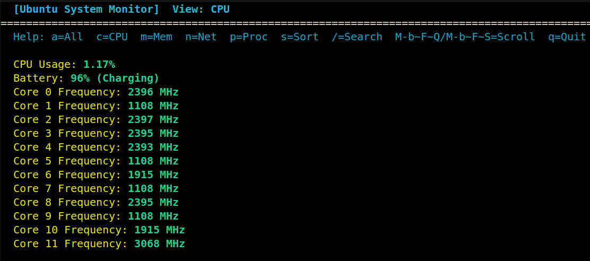
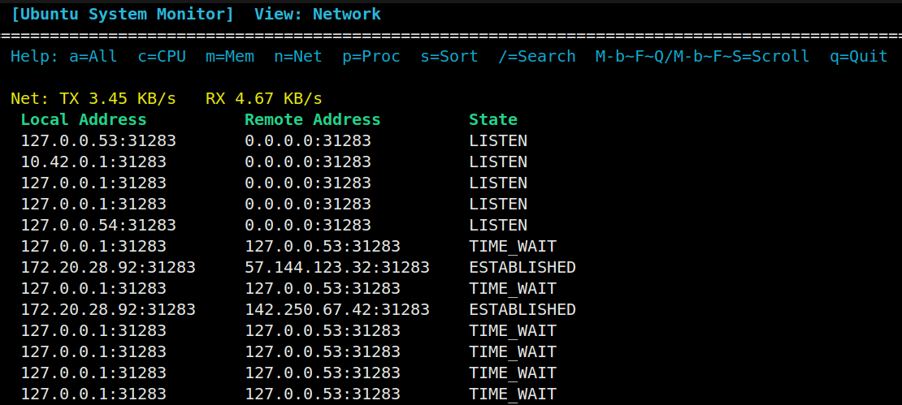
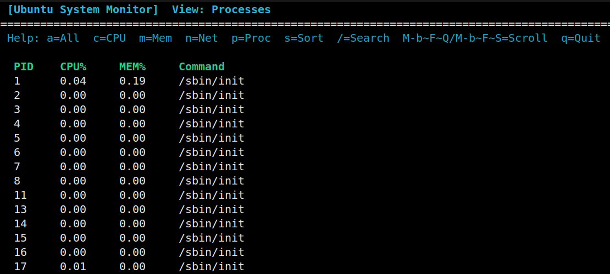
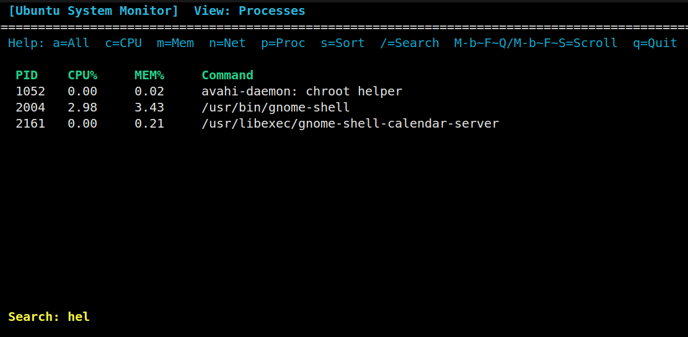

# Ubuntu System Monitor
> A modular and extensible Linux system monitor with real-time CPU, memory, disk, network, and process tracking — built entirely in C with `ncurses`.

## 🚀 Overview

**Ubuntu Sysmon** is a lightweight, real-time system monitoring tool designed for Linux systems. Built entirely in **C** using raw data from the `/proc/` and `/sys/` filesystems, it provides detailed insights into CPU usage, memory consumption, disk I/O, network activity, and running processes — all within an interactive terminal interface powered by **ncurses**.

This project was developed as a modular, extensible alternative to tools like `htop`, with the goal of understanding low-level system internals while delivering a responsive and visually organized monitoring experience.

Whether you're a developer, a sysadmin, or a Linux enthusiast, this tool helps you monitor critical system metrics directly from the terminal — without relying on bloated dependencies.

## 📸 Demo & Screenshots

Here's a glimpse of the terminal interface and features of **Ubuntu System Monitor** in action:

### 🎥 Full Demo Video  
<video src="assets/demo.mp4" controls autoplay muted loop width="100%"></video>

---


### 🔷 Main Dashboard
Displays real-time CPU, memory, disk, network, load average, and uptime statistics.


---

### 🧠 CPU Insights
Detailed view of CPU usage, frequency per core, and battery status (if available).


---

### 🌐 Network Monitoring
Tracks real-time RX/TX bandwidth and shows active TCP/UDP connections with local/remote addresses and states.


---

### 🧾 Process Manager
Lists all active processes along with PID, CPU%, MEM%, and command. Supports sorting and filtering.


---

### 🔍 Process Search
Use `/` to search for a specific process by name or PID. Press Enter to apply the filter.


## ⚙️ Features

Ubuntu System Monitor is built in clearly defined, modular phases — each adding specific functionality to the monitoring tool. Here's a breakdown of the key features:

---

### 🧱 Phase 1: Core System Metrics (via `/proc/` and standard Linux syscalls)

- **✅ CPU Usage**  
  Real-time CPU usage percentage calculated from `/proc/stat`.

- **✅ Memory Usage**  
  Tracks total, used, and free memory using `/proc/meminfo`.

- **✅ System Uptime**  
  Displays how long the system has been running from `/proc/uptime`.

- **✅ Load Average**  
  Shows 1, 5, and 15-minute load averages from `/proc/loadavg`.

- **✅ Disk Usage**  
  Displays total, used, and free space for each mounted filesystem using `statvfs()`.

- **✅ Network Stats**  
  Monitors real-time RX and TX bandwidth using `/proc/net/dev`.

---

### 🎛 Phase 2: Interactive TUI (Powered by `ncurses`)

- **✅ Modular TUI Layout**  
  Split-screen panels for CPU, memory, disk, network, and processes.

- **✅ Live Refresh Loop**  
  Auto-updates every 1–2 seconds to show real-time changes.

- **✅ Keyboard Navigation**  
  Use keys to switch between views (e.g., CPU, Memory, Network, Processes).

- **✅ Color-Coded Metrics**  
  Visualize performance metrics with color themes for better readability.

---

### 🧠 Phase 3: Process Manager

- **✅ Process Listing**  
  Parses `/proc/[pid]/stat` and `/proc/[pid]/cmdline` to list all running processes.

- **✅ Per-Process CPU% and MEM%**  
  Calculates individual process usage in real-time.

- **✅ Sort by Resource Usage**  
  Toggle sorting between CPU and memory consumption.

- **✅ Search & Filter Processes**  
  Press `/` to enter a search term and filter by name or PID interactively.

---

### 🔬 Phase 4: Advanced System Info

- **✅ CPU Frequency per Core**  
  Read from `/sys/devices/system/cpu/cpu*/cpufreq/scaling_cur_freq`.

- **✅ Disk I/O Speed**  
  Parse `/proc/diskstats` to estimate read/write throughput per second.

- **✅ Network Connections**  
  Monitor active TCP and UDP connections from `/proc/net/tcp` and `/proc/net/udp`.

- **✅ Battery Info (Laptop Only)**  
  Display battery status from `/sys/class/power_supply/BAT0`.

---

Each feature is implemented as an isolated module (e.g., `cpu.c`, `disk.c`, `network.c`) making the codebase highly modular, readable, and extensible.

## 📦 Installation

To install and run Ubuntu System Monitor on a Debian-based Linux system (like Ubuntu), follow these steps:

### 📋 Prerequisites

Make sure you have the following packages installed:

```bash
sudo apt update
sudo apt install build-essential libncurses5-dev git
````

### 📥 Clone the Repository

```bash
git clone https://github.com/aayush598/Ubuntu-Sysmon.git
cd uUbuntu-Sysmon
```

---

## 🛠 Build & Run

### 🔨 Build the Project

Use the included Makefile to compile the program:

```bash
make
```

This will generate an executable named `monitor` in the project root.

### ▶️ Run the Monitor

```bash
./sysmon
```

The terminal UI will launch and start displaying live system metrics. Use keyboard shortcuts to navigate between views (see [Usage & Keybindings](#-usage--keybindings)).

---

### 🧹 Clean Build Artifacts

To remove compiled object files and binaries:

```bash
make clean
```

## 🧪 Usage Guide / TUI Keybindings

Once launched, **Ubuntu System Monitor** opens an interactive terminal user interface (TUI) that updates in real-time. You can navigate and control the view using your keyboard.

---

### 🎛️ View Modes (Press Key)

| Key | Mode             | Description                                                   |
|-----|------------------|---------------------------------------------------------------|
| `a` | All              | Show combined CPU, Memory, Uptime, Load, Disk, and Network    |
| `c` | CPU              | View CPU usage, per-core frequency, and battery info (if available) |
| `m` | Memory           | Show detailed memory usage                                     |
| `n` | Network          | View bandwidth + connected TCP/UDP sockets with addresses     |
| `p` | Processes        | Show running processes with CPU% and MEM%                     |

---

### 🔍 Process View Controls

| Key        | Function                         |
|------------|----------------------------------|
| `/`        | Start typing to search processes |
| `Enter`    | Apply and exit search mode       |
| `↑ / ↓`    | Scroll process or network list   |
| `s`        | Toggle sorting (CPU% → MEM% → none) |

> ✨ You can search by process **PID or name** after pressing `/`.

---

### 🚪 Exit the Monitor

| Key | Action         |
|-----|----------------|
| `q` | Quit the program gracefully |

---

### 🖥️ UI Overview

- Real-time values update every second
- All data is read from `/proc` and `/sys`
- Color-coded metrics improve visibility
- View indicator and sort mode are shown at the top

---

With intuitive keyboard controls and a modular layout, this monitor delivers a rich terminal experience without sacrificing performance or control.


## 📁 Project Structure

The codebase is organized into modular components — each handling a specific system monitoring feature. Below is a high-level overview:

```

Ubuntu-Sysmon/
├── assets/                # Screenshots and visual assets for README
├── include/               # Header files (.h) for each monitoring module
│   ├── cpu.h              # CPU usage and frequency
│   ├── memory.h           # Memory usage
│   ├── uptime.h           # System uptime
│   ├── load.h             # Load average
│   ├── disk.h             # Disk usage and I/O
│   ├── network.h          # Network bandwidth and connections
│   ├── process.h          # Process listing, filtering, sorting
│   ├── battery.h          # Battery info (laptop)
│   ├── tui.h              # TUI layout components
│   ├── input.h            # Keyboard input handling
│   └── theme.h            # Color and formatting
│
├── src/                   # Source code (.c) implementations
│   ├── cpu.c
│   ├── memory.c
│   ├── uptime.c
│   ├── load.c
│   ├── disk.c
│   ├── network.c
│   ├── process.c
│   ├── battery.c
│   ├── tui.c
│   ├── input.c
│   └── theme.c
│
├── main.c                 # Entry point with TUI event loop
├── Makefile               # Build instructions
└── README.md              # Project documentation (this file)

```

---

### ✅ Highlights:
- **Modular Design:** Each module (CPU, memory, disk, etc.) is isolated into its own `.c`/`.h` pair for readability and maintainability.
- **Scalable Architecture:** Adding new features (like GPU monitoring or temperature sensors) is easy and non-intrusive.
- **Clear Separation:** UI, logic, and input handling are split across `tui.c`, `input.c`, and data modules.

---

## 📤 Contributing

Contributions are welcome! 🚀  
If you'd like to improve features, fix bugs, or add enhancements:

1. Fork the repository  
2. Create a new branch (`git checkout -b feature-name`)  
3. Commit your changes with clear messages  
4. Push to your fork and open a pull request

Feel free to open issues for bugs or feature requests. Let's build a better system monitor together!

## 🧾 License

This project is licensed under the **MIT License** — see the [LICENSE](./LICENSE) file for details.

## 🙋‍♂️ Author / Acknowledgements

**Developed by:** [Aayush Gid](https://github.com/aayush598)

- Final-year Electronics & Communication Engineering student
- Passionate about Linux systems, low-level programming, and embedded development

---

### 🙏 Acknowledgements

- Inspired by tools like `htop`, `nmon`, and `btop`
- Special thanks to the Linux `/proc` and `/sys` filesystem for making system introspection possible
- Built using the **C language** and **ncurses** for an efficient TUI experience
